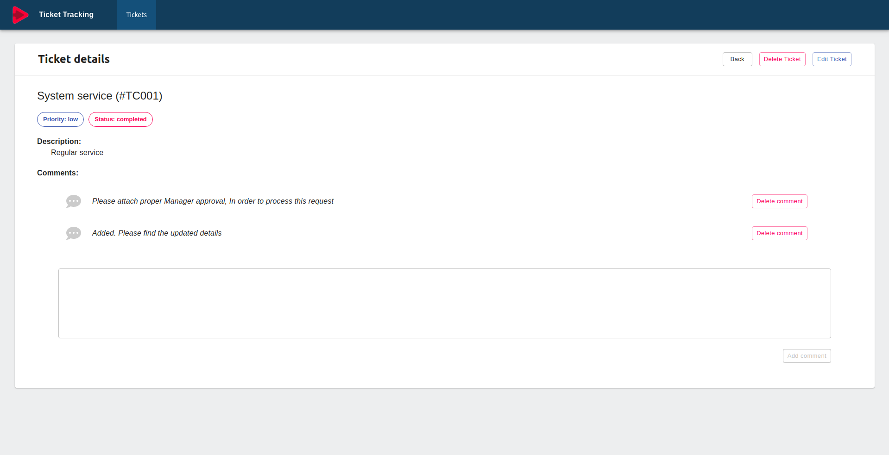

# Ticket Tracking

Ticket Tracking CRUD system using ReactJs, ExpressJs, MongoDB & GraphQL.



## Getting started
Clone the repo, followup the steps:

1. Install dependencies ```npm install```

1. Prepare all packages under the lerna environment ``` npm run bootstrap```

1. To start the both server & web application run ```npm start```


Open http://localhost:3000 to view web application

Open http://localhost:4000/graphql to interrogate with backend server